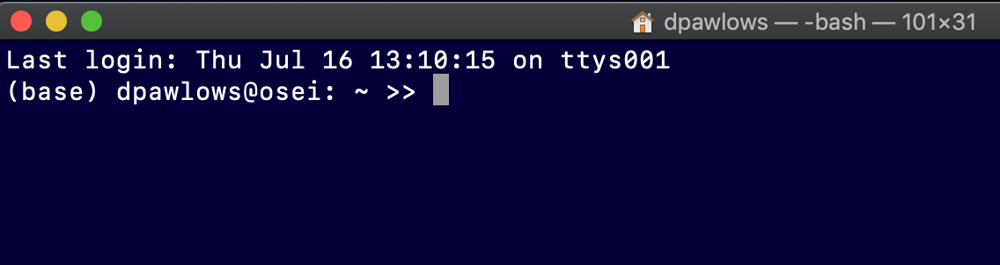
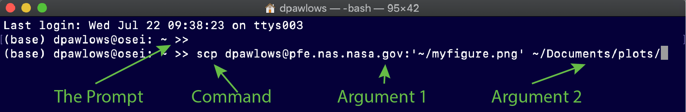

.. _theterminal:

The Terminal
============

Before we start learning how to use Linux (remember,
Linux is based on UNIX. I will use the two terms
interchangeably throughout the course), I want to
add a couple details about the Linux Terminal. Again,
the Terminal is the program that allows the user
to interface directly with the computer. Only
Linux/UNIX computers have a Terminal program, which is why
you all have been given an account on a remote computer.

   My Terminal at startup with some customization

On a Mac, you can open a Terminal by going to Finder > Utilities > Terminal.
On a Windows computer, again, there is no Terminal, but
you can open PowerShell by clicking Start and typing PowerShell
in the search bar. In both cases you can perform actions
by typing and executing specific *commands*.
As you type, your text will be entered into the *prompt*.
In the image above, the prompt is the line that ends with **>>**,
but note that
I have set my prompt to look that way. Yours will probably
look different. We will spend some time learning about a variety of commands
that allow us to create and manipulate files, perform basic
data analysis tasks, access remote computers and more
in this class.

When you execute a command
commands using the Terminal you may need to include
a(n) **argument(s)**; pieces of
information that a specific command needs to do its job.
Some commands do not require any arguments while others
may require 1 or more.

   A useful command

In the above example, I am using the ``scp`` command to
transfer a file from a NASA computer to my local computer
(this command is not available on windows computers).
We will talk about this command later, but you can
see that the first set of characters that come after the
prompt must always be a command. Then, any characters that
come after a command are arguments, each separated by
a space. In this
case, there are two arguments.

.. note:: I want to stress that the first set of characters
          that come after the prompt must be a command. A
          common error for users is to try to type a filename
          or something, and hit enter. Even if the filename
          that you are typing exists in the location that you
          are working in on your filesystem, you will still
          get an error. Another common error is to simply
          misspell the command that you are trying to enter.
