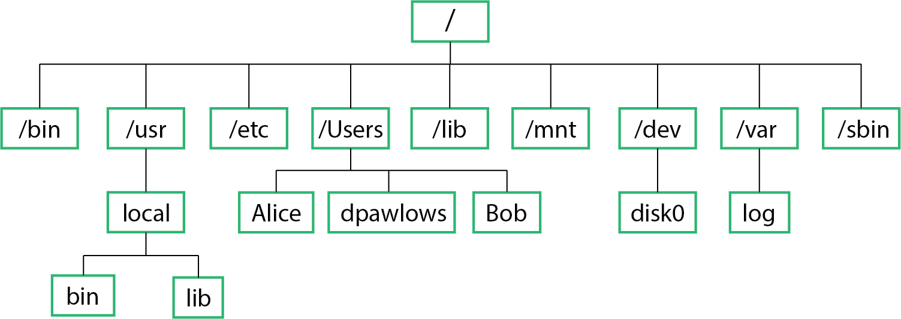

The Linux filesystem
====================

By now you should be able to
perform basic operations within the Linux operating system
including being able to: login, create and remove files, move around the filesystem, etc. Before we discuss
more Linux commands and other tools, it is important to have an understanding
of the file system including where and how to find things, and a
little bit about what is going on
in the background when you type a command.

Everything in Linux is a file
-----------------------------

Every Linux computer has a similar filesystem hierarchy in which there are standard
directories where certain files are placed. It is important to note that
**Everything in Linux is a file**
Again, everything in Linux is a file. The reason your mouse or printer works, the reason
the terminal spits out a bunch of information when you type *ls -l*, and the reason that
you are transferred to another computer when you use *ssh* is because there is a file
somewhere that does something when you perform these tasks. Being able to locate the
files, or figure out where they should be is important if you want to be able to use a
Linux system effectively. So, let's explore the filesystem a little.

The root directory
------------------

When you login to a Linux system, you are placed inside your home directory. This is
by no means the highest directory in the hierarchy, nor the most important. If you type
the command::

  >> pwd

and hit enter, you will see that you reside where you expect, i.e. for me, in the directory
/Users/dpawlows. As you know already, typing
::

  >> cd ..

brings you up one level in to the /Users directory. But that’s still not the highest level in the
hierarchy. There’s one level more. Type
::

  >> cd ..

to get there. Now, if you type ``>> pwd``
you should see that you are in the directory *“/”*. This is a special directory called
“the root directory” or just **root**. This is as high as you can go in the filesystem. Every
file on this computer is contained somewhere in this directory.

Every Linux machine has several subdirectories in root that are the same or at least very
similar from system to system. Figure 1 shows an example of the top levels of a typical Linux file hierarchy.

      The top levels of a typical Linux filesystem

Below are a few notes on some of these directories. For more
information, the command
::

  >> man hier

will bring up a man page that describes the Linux hierarchy.

Directories
-----------

/bin
^^^^

Contains fundamental executable files (commands or programs) that are used by users.
Only the most basic ones are here. Incidentally, the command
``which``
will tell you where an executable actually resides. For
example, try::

    >> which ls

/usr
^^^^

Contains most of the user's programs and applications. Important
subdirectories include:

  - /usr/bin: Contains most of the executables on your
    system, e.g. emacs, man, sort.
  - /usr/lib: Contains programming libraries- collections of
    program routines.
  - /usr/local: Contains user installed programs and files.
  - /usr/include: Contains include/header files, primarily
    for the C language.

/etc
^^^^

Most of the configuration files are installed here, such as those needed for the shell, ssh,
web server, etc. These files are used every time you start/use one of these things.

/Users
^^^^^^
Contains home directories for all the users on the system.
On some systems this is called /home instead.

/sbin
^^^^^

Executable files which are for system administration are stored here, as opposed to
programs used by normal users. For example, the command ``shutdown`` resides here,
which is a command that properly shuts the system down.

/dev
^^^^

Contains files which give access to devices like the keyboard, mouse, screen, bluetooth,
etc.

/var
^^^^
Contains output and “temporary” files such as log files and email messages.

Others
^^^^^^
In addition to these, Apple computers have other directories that are included in the root
directory, most of which are needed for the graphical user interface (GUI) side of the OS
or applications that are installed when using the GUI.

The Filepath
------------

There are two ways to enter a filepath (or just path) to a file or directory. The **absolute** path of a
file or directory is the path that you would get if you typed the pwd command. It starts
from root and goes down the file hierarchy to your cwd.
For example, try::

  >> cd /opt/anaconda3/bin/python

You just navigated to the directory for the python
executable by entering the
directory’s absolute path.

Instead, say you are already in */opt/anaconda3/*. Then, you could have simply entered
::

  >> cd bin/

and you would have ended up in the same place. In this case though, you would have
changed directories using the **relative** path. The relative path is based on the fact that the
file or directory in the right most position of the path that you entered actually resides
in the directory you are in. In other words, it is relative to your current position in the
filesystem.

For example, had you entered
::

  >> cd anaconda3/bin/

from your *home* directory, you would have received an error, because the file
~/anaconda3/bin doesn’t exist.
Entering a path either way is fine. It is just sometimes more convenient to enter a relative
path, since it is almost always shorter. However, when using a path when creating
a program or script, it is usually a good idea to use the absolute path, as you may
want to run the program from any directory in the filesystem, which means that the
relative path would usually not work.
