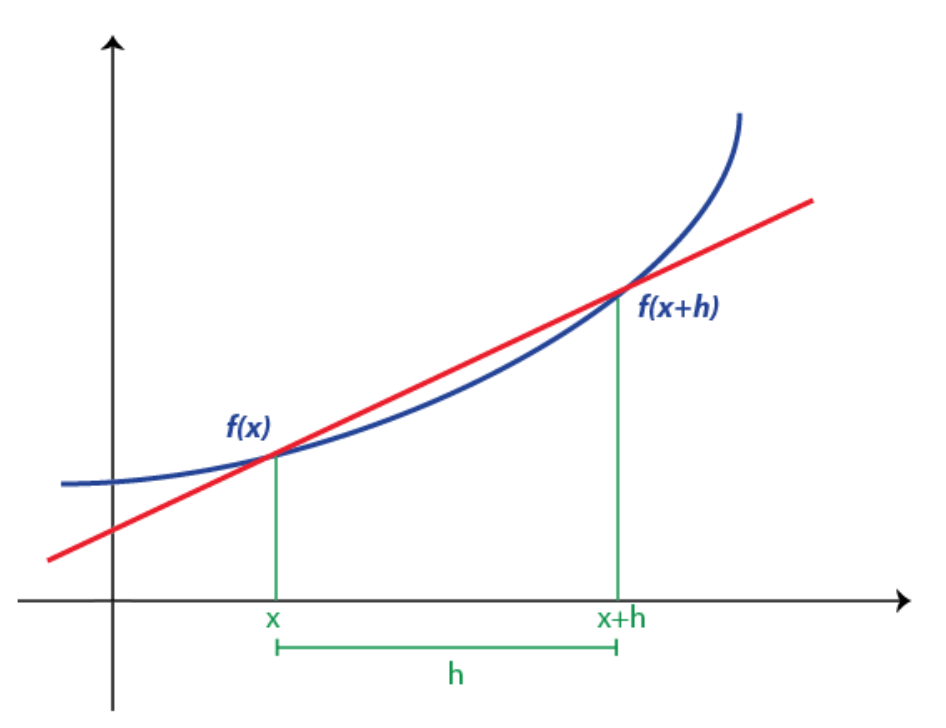
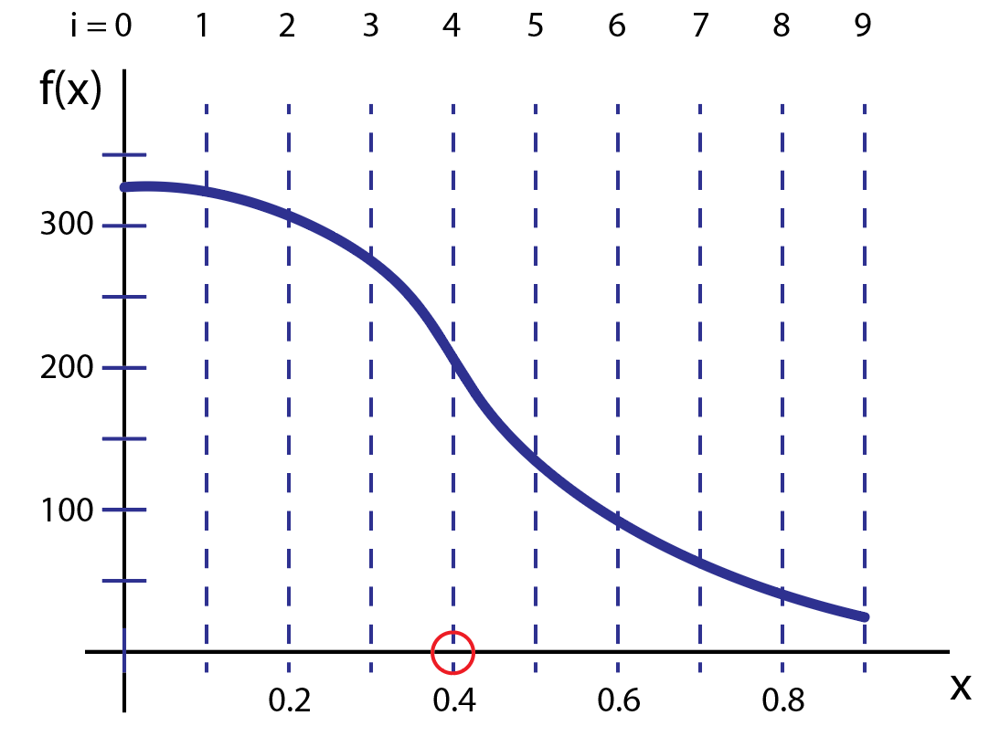

Numerical Differentiation
=========================

As any physics student knows, calculus is critical
to solving most interesting problems. The implicit
nature of calculus, which deals with the infinitely
small, is a bit tricky for computers, which are
fundamentally limited by the inability work
with infinities. So, it shouldn't be surprising that
any techniques that aim to calculate derivatives using a
computer are inherently approximations.
That said, we have some control over the performance
of our approximations.

Further, in the real world when an experimentalist
takes data from some apparatus or system and wants to
do analysis of that system, taking derivatives
poses the same problem. After all, data isn't continuous.
Data is discrete, where each data point is separated by
some "distance" in space, time, frequency, etc.
So, numerical methods for calculus in general, and
derivatives specifically, have existed for nearly as long
as calculus. Our job is to implement those techniques on a
computer.

Finite Differencing
-------------------

While there are a few different approaches to taking
numerical derivatives, we will use finite differences,
which involves taking the difference between the
values of a function at two points on some grid.

Analytically, the derivative of a function, :math:`f(x)`, is
given by:

.. math::

  f^\prime(x) = \lim_{h\rightarrow 0}\frac{f(x+h)-f(x)}{h}.

Computationally, we know that we can't let :math:`h` go to zero as
in that case, our solution will blow up. However, as we
have discussed, computers are great at doing repetitive
tasks very quickly. So that means we can make :math:`h`
small, and evaluate the derivative at many points
on our grid that are very close together.
Thus, in order to find the derivative of some function,
we need to establish a grid, with grid spacing :math:`h`.
If our dependent variable is :math:`x`, then our grid
would generically be something like:

.. math::
  \dots, x-3h, x-2h, x-h, x, x+h, x+2h, x+3h,\dots

and since we know the function for which we want the derivative,
we could evaluate the function at each of these points.
Armed with this information, we can approximate the
derivative:

.. math::
  :label: eq-forward

  f^\prime(x)\approx \frac{f(x+h)-f(x)}{h}.

Approximating the derivative in this way is
logical. Essentially, we are assuming the
function that we are given is linear between
two successive points on our grid:

Clearly there will be some error, but as h gets smaller, we do a better job of approximating
the true derivative.

Forward and Backwards Differencing
----------------------------------

Eq :eq:`eq-forward` above isn't the only technique
that we can use to approximate a derivative. To see
other options, it helps to turn to our old friend,
the Taylor Series:

.. math::
  :label: Taylor

  f(x+h)=f(x)+\frac{f^\prime(x) h}{1!}+\frac{f''(x)h^2}{2!}+
  \frac{f'''(x)h^3}{3!}+\dots

We can use this to approximate :math:`f'(x)` by
keeping just the first two terms on the right side:

.. math::

  f(x+h) = f(x)+f'(x)h

which gives:

.. math::

  f'(x) = \frac{f(x+h) - f(x)}{h}

exactly what we have in eq :eq:`eq-forward`. Approximating
the derivative using this formula is called a
**forward differencing scheme** because as it is
written, to find the derivative at the grid point :math:`x`,
we use the forward value at :math:`x+h`.

Alternatively, we could have chosen to find the derivative
using **backward differencing**. That requires the
Taylor series for the point at :math:`x-h`:

.. math::

  f(x-h)=f(x)-f'(x)h

solving for :math:`f'(x)` gives :math:`f'(x) = \frac{f(x) - f(x-h)}{h}`.

Truncation Error
----------------

You'll recall that we have already discussed one of the
main sources of error for any given numerical scheme:
*round-off error*. In deriving the forward (or backward)
differencing scheme, we introduce another type of error,
**truncation error**, named such because we *truncate* the
Taylor series after the first 2 terms:

.. math::

    f'(x) = \frac{f(x+h)-h(x)}{h} + \mathcal O(h^2).

Here, :math:`\mathcal O(h^2)` tells that we have truncated
terms that have an :math:`h^2` or higher. As such,
we would consider this scheme to be "first order accurate"-
only terms with an h to the first power are in
our approximation.

The "order" of an approximation tells us how much better
our solution gets if we make the grid spacing smaller. For
a first order scheme, if we increase the step size by a
factor of 2, we expect the solution to get 2x more accurate.

Central Differencing
--------------------

That said, we can do better than a first order scheme.
How to do that? Well, let's keep the 2nd order
term in our Taylor series!

.. math::
  :label: forwardtwo

  f(x+h) = f(x)+\frac{f^\prime(x) h}{1!}+\frac{f''(x)h^2}{2!}

The problem is, I want to solve this equation for :math:`f'(x)`
but if I do, that, I will have an :math:`f''(x)`.
In order to get rid of that term, I need be a little sneaky.
Let's use the Taylor series about the backward point:

.. math::
  :label: backwardtwo

  f(x-h) = f(x)-\frac{f^\prime(x) h}{1!}+\frac{f''(x)h^2}{2!}

Then, I can subtract Eq :eq:`backwardtwo` from Eq :eq:`forwardtwo`:

.. math::

  f(x+h) - f(x-h) = f'(x)h +f'(x)h

and solve for :math:`f'(x)`:

.. math::
  :label: central

  f'(x) = \frac{f(x+h)-f(x-h)}{2h}+\mathcal O(h^3).

This is called a central differencing scheme. We want
the derivative at grid point x and to find it, we
use the two grid points on either side :math:`(x-h)`
and :math:`(x+h)`. Keeping the 2nd order terms in the
series means that this is a 2nd order scheme. But,
that didn't really cost us anything as we were able
to cancel those terms out by combining two Taylor series
about two different points.

Implementation
--------------

The figure below shows a generic function as a function
of x. Since our function only depends on x,
it is inherently 1D. Units are arbitrary. You can imagine this line
showing the velocity profile (vertical axis) of a car as it travels
along a straight road (x axis).

In order to solve for the derivative of this function
using a computer, we first break up the
domain into discrete points, i.e. setup our grid.
This is represented by the vertical dashed lines.
For our purposes, there are two ways of referring to an individual grid
point. For example, say I want to reference the
grid point circled in red. I can either specify the
value of the dependent variable at that location (0.4) or,
I can refer to the grid point index (4), where the
index is obtained by counting from the start of the
grid (the origin). This is analogous to a list (or array) in python.
Consider the line:

::

  >>> position = numpy.arange(5,10.1,.2)
  >>> print(position)

  [ 5.   5.2  5.4  5.6  5.8  6.   6.2  6.4  6.6  6.8  7.   7.2  7.4  7.6
  7.8  8.   8.2  8.4  8.6  8.8  9.   9.2  9.4  9.6  9.8 10. ]

This creates a numpy array that starts at value of 5 and ends at
value of 10 with spacing of 0.2. For any given point
I can refer to a position by value (say 5.4) or its
location in the array (its index value). 5.4 is the 3rd element
in the list, so its index is 2 since we start counting at zero.
This may all seem obvious, but one of the biggest issues
that students who are new to scientific computing have
is understanding when they need to access an array's value
or the index that corresponds to that value.

Back to the central differencing scheme. If I want to
find the derivative of the blue line above numerically,
I can implement central differencing as in Eq. :eq:`central`.
Let's say that I want to find the derivative of :math:`f(x)`
on the interval x=[0,0.9] and I use the grid as shown. This
means that I know the value of the function at 10 grid points.
However, in order to find a derivative at some grid point
using Eq. :eq:`central`,
I need to use the function evaluated at the grid point to
the left and to the right. Thus, I can't determine the derivative
at the first and last grid points.

To make this more explicit: let :math:`i` stand for the index value
of the grid point I am interested in. Then:

.. math::

  f'_i = \frac{f_{i+1}-f_{i-1}}{2h}

where :math:`f_i` represents the function value at the :math:`i^{th}`
grid point. As you can see, the lowest index value for
which I can solve for :math:`f'_i` is :math:`i = 1`!

In this specific example, the :math:`i = 0` and :math:`i = 10` grid points
(corresponding to values of x = 0 and x = 0.9) are considered
part of the domain *boundary*. If I really needed the values of
the derivative there, I would need to be told something about
the boundary conditions for this problem (e.g. the function is
constant across the boundary, the derivative is constant across
the boundary, etc.).

With those details presented, implementation central differencing
scheme is not very complex. Generically something like:

::

  stepsize = 0.1
  fprime = np.zeros(10)
  i = 1
  while i < len(fprime)-1:
      fprime[i] = (myfunction[i+1]-myfunction[i-1])/(2*stepsize)
      i += 1

would work assuming I've defined the variable "myfunction" to
have information about the function that I am trying to
differentiate.
