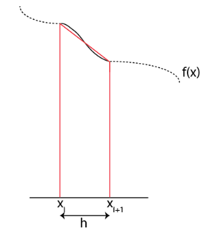

Numerical Integration
=====================

In upper level physics, we constantly run in to integral
problems that are difficult, if not impossible, to solve analytically.
Systems that are more complex than the most basic examples often
require the use of approximations that may not be applicable to
a particular problem. Luckily, there exist a wide swath of numerical
techniques that can be implemented to attack such problems.
Here, we will cover a few of them as a study on how such techniques
are developed and how to implement them. It should be noted that
today's computing languages often come with all, and more, of these
techniques implemented in pre-existing software libraries.

Given some function :math:`f(x)`, we would like to find the solution the
integral:

.. math::

  I = \int_a^bf(x) dx

Techniques for solving this problem all stem from the fundamental definition
of the integral. Given some function, :math:`f(x)`, the integral is equal to the area
under the curve defined by :math:`f(x)`
between the points :math:`a` and :math:`b`. Our job is to use the computer
to find a estimate for that area.

Numerically, this means that we have to break up the area into discrete
chunks and sum the area of each chunk. The question is: how to
break up each chunk?

Rectangular rule
----------------

Since finding the area of a rectangle is pretty easy,
perhaps the simplest method that we can choose would be to break up the
domain that we are interested in into several rectangular chunks. This
means that for each rectangle we must define the width of the
rectangle (the difference between two points on our grid) and
the height of our rectangle (the function evaluated at some point,
:math:`f(x_i)`).
There are a few options when it comes to selecting the height.

Let's say that I want to evaluate the area of the :math:`i^{th}` rectangle.
The width of my rectangle is :math:`x_{i+1} - x_i`. The height
can either be defined using :math:`f(x_i)` or :math:`f(x_{i+1})`. As you
can see in the figure below, this will result in some error, either
an underestimate of the true area or an overestimate depending on
the behavior of the function.

  Choosing the left point results in an overestimate.

  Choosing the right point results in an underestimate.

This method of approximating the area under the curve is known as the
rectangular rule. Once we set up a grid (:math:`x_0, x_1, x_2, \dots x_n`)
and evaluate our function at each point on the grid, it is easy to
calculate the area of each rectangle and sum to get the integral. E.g.
we can approximate the integral using the points on the left side
of our rectangle using::

.. math::

  I = \sum_{i=0}^{n-1}f(x_i)h

A common adaptation to the rectangle rule is to use the midpoints of
our grid as the point at which to evaluate the "height" of our function.
If we don't actually know the value of our function at those points, we
can interpolate. This gives us the *midpoint* rule:

.. math::

  I = \sum_{i=0}^{n-1}f(\frac{x_i+x_{i+1}}{2})h

Trapezoid rule
--------------

It is clear from the above figures that there can be significant error
when implementing the rectangular rule. An alternative then, is instead
of breaking the domain up into rectangles, use trapezoids!

  Trapezoids allow us to use information about the function at both
  grid points

Calculating the area of a trapezoid is not much more difficult that
doing so for a rectangle, and the sum is similar:

.. math::

  I = \sum_{i=0}^{n-1}\frac{f(x_i)+f(x_{i+1})}{2}h

As you can see from this sum, the function is evaluated twice at
each point on our grid, with the exception of the first and last

grid points. Written out, the sum looks like:

.. math::

  I = \left(\frac{f(x_0}{2}+f(x_1)+f(x_2)+\dots+\frac{f(x_n)}{2}\right)h

In this form, the trapezoid rule looks quite similar to the rectangle
rule (and also the midpoint rule). The only difference being that we divide the function evaluated
at the first grid point by 2, and add and extra term: :math:`\frac{f(x_n)}{2}`.
This should tell you that while we might think the trapezoid rule is
much more accurate that the rectangle rule, it actually isn't that
much better.

In fact, we can calculate the error of these two methods:

.. math::

  error_{midpoint} &\approx -\frac{h^3}{24}f''\\
  error_{trapezoid} &\approx \frac{h^3}{12}f''

where both error terms depend on the 2nd derivative of the function and
the negative sign means that the approximation underestimates the
solution when the function is concave up. By taking a weighted average
of the two methods, we can effectively cancel out these errors and
come up with a new method!

Simpson's Rule
--------------

The weighted average looks like:

.. math::

  I_s = \frac{2I_m+I_t}{3}

where :math:`I_m` represents the integral calculated with midpoint rule and
:math:`I_t`
represents using the trapezoid rule.

Based on that formula, we can combine the summations above to write down
the Simpson rule:

.. math::

  I&=\frac{h}{3}\left(f(x_0)+2\sum_{i=1}^{n/2-1}f(x_{2i})+4\sum_{i=1}^{n/2}
  f(x_{2i-1})+f(x_n)\right)\\
  I&=\frac{h}{3}\left(f(x_0)+4f(x_1)+2f(x_2)+4f(x_3)+2f(x_4)+\dots+4f(x_{n-1})
  +f(x_n)\right)

Note that **n must be even**. This technique results in an error proportional
to :math:`h^5`, which is much better than our options above. Additionally,
the error depends on the fourth derivative of the function in question,
which means that it is exact for any polynomial of 3 degrees or less,
a nice bonus.

Implementation of Simpson's rule is only slightly more complex than
the rules above, only because the coefficient changes depending on if
we are dealing with a odd or even grid point. There is a slight computational
expense associated with performing the extra floating point
operation. However, the improved accuracy over the midpoint method
makes Simpson's rule a good choice for typical integration tasks.

Monte Carlo techniques
----------------------

The techniques discussed above are all based on the concept of
interpolating the function that needs to be integrated in some way.
However, there are other techniques that we can think of
that attack the problem in a different manner. One class of
such techniques are Monte Carlo methods, named because they
involve some measure of randomness.

To illustrate the concept, imagine that you wanted to calculate the area
of a circle, but you didn't know anything about :math:`\pi`
or any of that. Instead, you chose to surround the circle by a
square, for which you **do** know how to calculate the area. One might
draw such a diagram on a piece of paper:

Next, we throw darts at the paper and we take a tally of total number of
darts that were thrown as well as the darts that
land inside the circle.

.. figure:: images/circ2.png
  :width: 400px
  :alt: monte carlo2
  :align: center

Inside the circle = 1, Total 1

Inside the circle = 2, Total 3

Inside the circle = 4, Total 7

  Inside the circle = 40, Total 50

So, 40 out of 50 darts are inside the circle, or 80%. So,
assuming the darts were thrown randomly, I could approximate the
area of the circle by :math:`a_c\approx 0.8A_s`.

If my square has an area of 4 units, then

.. math::

  A_c=4.0*0.8=3.2\approx\pi r^2=3.1415

Not a bad approximation!

In other words, I can implement this to find the integral of a function
but picking a **random** coordinate :math:`(x,y...)` in the domain.
Then, solve the function at that coordinate :math:`f(x)`. Assuming I am taking the
integral with respect to :math:`y`, I could check to see if the
random :math:`y` value that I picked in the first step is less
than f(x). If that is the case, I would tally that point as "in".
Repeat the procedure with some number, n, of random points. Then, the
integral is approximated by the *area (volume, etc) of the domain \* in / n*.
Of course, the larger n, the better the approximation.

Monte Carlo techniques tend to be slower for low dimensional problems.
If you are doing 1D or 2D integration, it is best to stick with
Simpson's rule if possible. However, if you have a higher dimensional
problem, 3D, 4D, etc. then Monte Carlo methods can be extremely beneficial.
