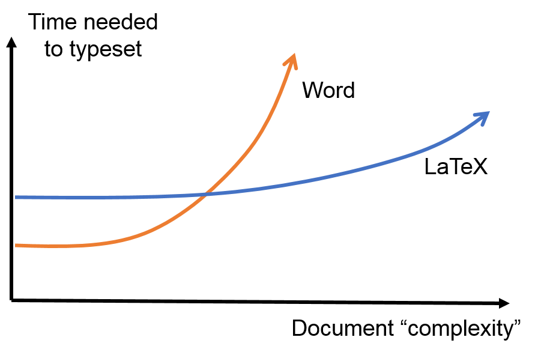
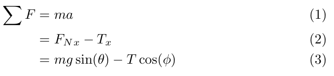
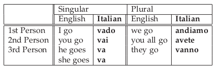
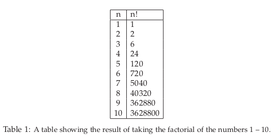
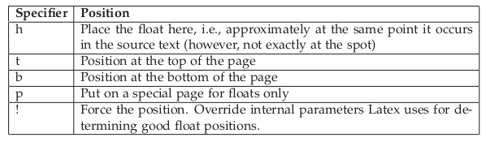

Latex Basics
============

Latex is a document preparation system for high-quality typesetting. It is used by a large
to create documents by a large part of the scientific community
as well as to prepare technical documents in a wide range of fields. I'll start
by saying Latex is not a
word processor. The whole point of Latex is to allow the author to focus on their writing,
and not on the document styling. Latex is great for preparing journal quality articles and
has features that can handle sectioning, cross-references, tables, and figures. It makes
the typesetting of math formulae straightforward and quick. It automatically generates
bibliographies and indices, and seamlessly accommodates the inclusion of graphics.
And yes, it also handles formatting, but it separates the formatting
process out from the writing process so that, again, the focus can stay on the
writing.

Learning how to use Latex can be a frustrating process. But, I absolutely promise that
once you get through the learning pains, Latex will save you an huge amount of time
when preparing your documents. Additionally, they will look much more professional than if
you used other word processors. Ultimately, Latex makes things that are very
difficult to do in other software relatively easy. The cost of this is a
little more effort to get your documents set up. The figure below
summarizes the idea quite well:

  Word vs. Latex: a summary (this version of the plot by JL Blanco, MappingIgnorance.org)

Basics
------

To get started, you will need access to a Latex distribution. There are many.
If you don't have any other option, serenity has a distribution installed
that you can use via the command line. However, in recent years,
web based latex solutions have popped up online and are probably
the easiest way to get started as you don't have to download any
extra software. Today, `Overleaf <https://overleaf.com>`_ is one of the better
options for web based Latex. You can set up a free account which even includes
some limited collaboration options.
If you would prefer to download a Latex distribution, `MikTex <https://miktex.org/download>`_ and `Texlive <https://www.tug.org/texlive/>`_ are both good options.
Before you go any further, set up an account on Overleaf or download and install a
latex distribution.

Many people make the claim that using Latex is like coding your papers. In a sense,
it is. The file that contains your writing also has commands that define the document
structure and formatting. In addition, in order to produce the final document, you have
to compile the latex document. In that sense, using latex isn't as simple
as opening up a document and starting to write. We need to specify some
basic commands to tell Latex what we are doing.

Three things every Latex document must have
^^^^^^^^^^^^^^^^^^^^^^^^^^^^^^^^^^^^^^^^^^^

There are three commands every Latex document must have for Latex to compile
(compiling takes the latex commands and allows them to operate on the
content of the document to produce some sort of output, e.g. a final pdf)
successfully. Those commands are: **`\documentclass{ }`**, **`\begin{document}`**
and **`\end{document}`**. Before we create our first document, let's
talk about these commands in a general sense.

First, note the Latex syntax. All latex commands start with the character
`\`. The backslash is a special character in Latex, which means you can't
just go around using it willy-nilly. If you type that key in a Latex document,
you have to use it properly. Next, each of the commands above were followed by
a set of curly brackets `{ }`. Anytime you see curly brackets in Latex, those
represent a place where you need to include a *required argument*.
Alternatively, you may see commands that use square brackets, `[ ]`. Those
enclose *optional* arguments.

To the first required command. `\documentclass{ }` is required of every
Latex document and it requires 1 argument: the document class. There are several
to choose from: `proc`, `report`, `book`, `slides`, etc. But, you will always be
using the `article` class in this course.

The other two required commands, `\begin{document}` and `\end{document}` tell
latex where the content of the document begins and ends. The `\begin` and `\end`
commands generally define a Latex *environment*. You will use them
often, but with different arguments. The basically allow you to add a variety of
your elements, including figures, tables and lists, to your document. But
the main *environment* is of course the document. Anything that you want to
actually show up in your final document must go between the `\begin{document}`
and `\end{document}` commands. With that, let's create a very simple document::

  \documentclass{article}

  % preamble

  \begin{document}

  Hello World!!

  \end{document}

Use whatever Latex distribution you are using to create a first document
and compile it (typically, if you are using web based software, there is a
recompile or compile button that you can click on). If you have just these
elements, you should see the text "Hello World!" in the output.

In this simple example, I made use of a Latex comment, which is designated
using the `%` character. Any lines that start with that character are
ignored by the Latex compiler. In this example, I wrote the word "preamble".
Any content in our document that comes after the `\documentclass` but
before `\begin{document}` is referred to as the preamble. This space is
reserved for configuration options for our document, defining and redefining commands, and generally setting up preferences. We will talk more
about some of this stuff later, but **generally**
the preamble contains information about document-wide formatting, as well as
information about Latex packages that you may use in the body. The body contains the
content of the document, as well as small scale text formatting commands.

The Preamble
------------

Before we get into the syntax, let's briefly discuss the preamble. Remember
that I said the goal of a good typesetting program is to separate the formatting
from the actual writing. In some sense, this is the goal of the preamble.
It is here that we specify the document wide formatting options, including
the fonts, margins, spacing, list formatting, section formatting, and more. But,
there are many other things that we can do in the preamble as well.
The preample is the place that we will "import" additional functionality into
our documents by adding Latex packages. This is done via the
`\\usepackage{}` command. This command takes at least one required
argument, the name of the package that you want to import. Standard latex
distributions come with many, many packages that you may find useful. Among
those, you will probably use the *amsmath*, *graphicx* and *natbib* packages
regularly. In order to use them, you must include them with the `\\usepackage`
command in the preamble.

General syntax
--------------

There are a few Latex syntax guidelines that you should remember:

1. Spaces and line breaks aren't important with one exception: one or more blank lines starts a new paragraph.
2. Commands always start with a backslash, \\.
3. Curly brackets are used for required arguments for example: `\documentclass[11pt]{article}`.
4. Square brackets are used for optional arguments.
5. Commands are case sensitive.

The most common optional arguments to `\documentclass` are:

- 11pt- uses 11-point font instead of default size
- 12pt- uses 12-point font instead of default size
- twocolumn- produces two column output

Sectioning
----------

Latex has several levels of sectioning that make it easy to structure your document:

::

  \section{section name}
    \subsection{subsection name}
      \subsubsection{subsubsection name}

The title of each section goes in the braces. Latex will automatically number your sections, and there are options for different number schemes.

Font Styles
-----------

Latex will automatically set the font for you, but you can specify other styles on the fly:

• `{\\em text}`- italics
• `{\\tt text}`- fixed-width typewriter-like font
• `{\\bf text}`- bold font

The use of the curly brackets allows the inclusion of multiple words. If you only wanted
to boldface a single word, you don’t need the braces, e.g.: ``\\bf Hello world``
will result in **Hello** world.

Lists
-----

To create any time of list, you need to enter a list environment. Environments are common ways in Latex to perform formatting on a block of text. This is opposed to inline
formatting, where the formatting is applied to a text element. To enter an environment,
you enclose the text with in a ``\begin{}..\end{}`` block, just like you enclose the text of
your latex file using the ``\begin{document}`` and ``\end{document}`` commands. There are 4 types of lists in Latex:

• Bulleted- to create a bulleted list, you use enclose your list with the commands ``\begin{itemize}`` and ``\end{itemize}``. Each item in your list is prefaced with the ``\item`` command (no braces).
• Enumerated- to create a numbered list use ``\begin{enumerate}`` and  ``\end{enumerate}``, and again, use ``\item``.
• Descriptive- composed of subheadings followed by one or more indented paragraphs. To create a descriptive list, use ``\begin{description}`` and ``\end{description}`` and use ``\item``.

You can also make nested lists by defining another list environment within a list environment. Latex will handle the nesting and make an alternative bullet or numbering scheme.

Special Characters
------------------

Since certain characters are used in Latex commands (e.g., the backslash and curly
braces), if you want to actually print these characters in your document, you
have to **escape** them (not to treat them as part of a
command). Generally, this is done with a leading backslash. However, there are some exceptions::

  Character   Command
  \           $\backslash$
  $           \$
  %           \%
  ^           \^
  &           \&
  _           \_
  ~           \~
  #           \#
  {           $\{$
  }           $\}$

Math
----

One of the reasons that a lot of people transition to Latex is due to the
ease of rendering mathematical expressions. Today, you can find
Latex math syntax incorporated in many services, including add-ons for gmail as
well as in Canvas.

There are two ways to use math mode: inline and display. In inline, math
is rendered inline with the text: e.g. :math:`y=\cos^2(\theta)`. In display
mode, the math content is separated from the text:

.. math::
  y = \cos^2(\theta)

Inline
^^^^^^

Entering inline math mode is done using the special symbol: $. The dollar sign
lets latex know to treat certain symbols in a special way. For example,
entering `$a^2+b^2=c^2$` results in :math:`a^2+b^2=c^2`.

Display
^^^^^^^

For display mode, there are several options. The simplest option is to use
two dollar signs instead of one: `$$a^2+b^2=c^2$$` will produce:

.. math::
  a^2+b^2=c^2

Again, Latex doesn't care about whitespace, so I can type the above expression
inline with the text in my Latex document, as I've done here, but it will
be rendered separate from the text. The use of $$ is the quickest way
to enter display math mode, but by default, it does not result in numbered
equations nor will it align them if you are trying to display an equation
set. For this reason, many people prefer to use the *amsmath*
when writing extensive mathematics in their documents. Again, to do this
include the ``\usepackage{amsmath}`` command in your document's preamble.
Amsmath gives us access to a modified *align* environment which
allows us to align math expressions and number them at the same time.
For example::

  \begin{align}
    \sum F&=ma \\
    &=F_N_x - T_x\\
    &=mg\sin(\theta)-T\cos(\phi)
  \end{align}

results in:

  Using the amsmath package gives us an align environment that produces
  numbered and aligned equations.

Note the use of the & character. This is Latex's *alignment* character.
It is not printed in the rendered document. Instead it results in alignment of the equations where that character is located.

Basic Math
^^^^^^^^^^

Once we enter math mode, the syntax and key combinations to do various things
is meant to be somewhat intuitive. I'll provide an overview of the basics here
but I'll refer you to the summary here: https://en.wikibooks.org/wiki/LaTeX/Mathematics.

**Arithmetic Operations:** The plus (+), minus (-), division (/) symbols have the usual
meaning. To denote multiplication explicitly (this is rarely necessary), use ``\cdot`` (pro-
ducing a centered dot) or ``\times`` (producing an ”:math:`\times`”). The equal, less than, and greater
than symbols on the keyboard work as expected; to get less than or equal, use ``\le``;
similarly, ``\ge`` gives greater than or equal.
Square roots are generated with the command ``\sqrt{...}``: ``$z=\sqrt{x^2+y^2}``
gives :math:`z=\sqrt{x^2+y^2}``.

**Subscripts and superscripts**: These are indicated by carets ˆ and underscores _, as
in ``$n^2$`` or ``$a_1$`` which produce :math:`n^2` and :math:`a_1` respectively.
If the sub/superscript contains more than one character, it must be
enclosed in curly braces, as in ``$2^{x+y}$``.

**Fractions**: Fractions are typeset with ``$\frac{x}{y}$``, where x stands for the numerator
and y for the denominator. An example: ``$\frac{f'(x)(x-a)}{n!}$`` produces
:math:`\frac{f'(x)(x-a)}{n!}`.

**Sums and Integrals**: The symbols for sums and integrals are ``\sum`` and ``\int``, respectively. These are examples of ”large” operators, and their sizes are adjusted by TeX
automatically, depending on the context (e.g., inline vs. display math). Note that
the symbol generated by ``\sum`` is very different from the capital sigma Greek symbol, ``\Sigma``; the latter should never be used to denote sums. TeX uses a simple,
but effective scheme to typeset summation and integration limits: Namely, lower and
upper limits are specified as sub- and superscripts to `\\sum` and `\\int`. For example,
``$\sum_{k=1}^n k = \frac{n(n+1)}{2}$`` produces
:math:`\sum_{k=1}^n k = \frac{n(n+1)}{2}`. (Note that the ”lower limit” k=1 here must
be enclosed in braces, because it is more than 1 character long). Typically
"large" operators are used in display mode as opposed to inline mode:

.. math::

  \sum_{k=1}^n k = \frac{n(n+1)}{2}

Further, if one uses parenthesis or brackets in an expression that uses
large operators or fractions, the ``\left`` and ``\right`` commands are often
used to assist in the correct sizing of those symbols. Compare
``$$[\sum_{i=1}^n\frac{f^{i}(x)}{i!}(x-a)^i]$$``:

.. math::

  [\sum_{i=1}^n\frac{f^{i}(x)}{i!}(x-a)^i]

with ``$$\left[\sum_{i=1}^n\frac{f^{i}(x)}{i!}(x-a)^i\right]$$``:

.. math::

  \left[\sum_{i=1}^n\frac{f^{i}(x)}{i!}(x-a)^i\right]

**Greek Letters**: The commands for Greek letters are easy and intuitive: Just type
``$\epsilon$``, ``$\delta$``, ``$\nu$``, ``$\phi$``, etc. To get upper case versions of these letters,
capitalize the appropriate command; e.g., ``$\Delta$`` gives a capital Delta.

Tables
------

Tables are produced in Latex using the tabular environment, as in \begin{tabular}
and \end{tabular}::

  \begin{tabular}{|c|l|}
    \hline
    n & n! \\
    \hline
    1 & 1\\
    2 & 2\\
    3 & 6\\
    4 & 24\\
    5 & 120\\
    6 & 720\\
    7 & 5040\\
    8 & 40320\\
    9 & 362880\\
    10 & 3628800\\
    \hline
  \end{tabular}

When beginning the tabular environment,
there is a required format specification, the stuff you see in the second set of curly braces.
That tells latex how many columns to use, how to justify the text in the columns, and
where to put vertical bars (using the | key). In this example, we have two columns. The
first is center-justified and the second is left justified. In addition, there is a vertical bar
on both sides of the table, as well as one separating the two columns. Other options here
are::

  l         specifies a column of left-justified text
  c         specifies a column of centered text
  r         specifies a column of right-justified text
  p{width}  specifies a left-justified column of the given width
  |         inserts a vertical line between the columns
  @{text}    inserts the given text between the columns

Once you’ve set the table up, its time to add the content. Horizontal bars are added
using the ``\hline`` command. Then, each row in the table is written. Columns
are separated by the ampersand, &. Since we only have two columns, only one
ampersand is used in each row. Since whitespace doesn’t matter in latex, you let Latex
know to start a new row using the new line command, two backslashes, ``\\``.
Notice that there is no need to give any information on the dimensions of the table.
Latex does all that for you.

You can have text that spans multiple columns very easily. Also, you can include normal
Latex typesetting commands::

  \begin{tabular}{|l||l|l||l|l|}
    \hline
    &\multicolumn{2}{l|}{Singular}&\multicolumn{2}{l|}{Plural}\\
    \cline{2-5}
    &English&{\bf Italian}&English&{\bf Italian} \\
    \hline\hline
    1st Person&I go&\textbf{vado}&we go&\textbf{andiamo}\\
    2nd Person&you go&\textbf{vai}&you all go&\textbf{avete}\\
    3rd Person&he goes&\textbf{va}&they go&\textbf{vanno}\\
    &she goes&\textbf{va}& & \\
    \hline
  \end{tabular}

Results in:

  An advanced table with text that spans multiple columns.

Notice how the last line has two blank cells. Also, the ``\cline`` command has been used, which “clears the line”.

Table as a float
^^^^^^^^^^^^^^^^

A table created as described above will place the table "in line" with the text.
Typically, we want our tables to "float", or adjust position in the text so that the table is at the top or bottom of the page. Floats exist to deal with the problem of an object that won’t fit on the
present page. The are not part of the normal stream of text, but separate entities, and
are position in a part of the page to themselves (top, middle, bottom, left, right, etc. As such, we need to wrap our
tabular environment in another environment::

  \begin{table}
    \centering
    \begin{tabular}{|c|l|}
    \hline
    n & n! \\
    \hline
    1 & 1\\
    2 & 2\\
    3 & 6\\
    4 & 24\\
    5 & 120\\
    6 & 720\\
    7 & 5040\\
    8 & 40320\\
    9 & 362880\\
    10 & 3628800\\
    \hline
    \end{tabular}
    \caption{\small A table showing the result of taking the factorial of the numbers 1 -- 10
  \end{table}

This produces the following table:

Note that we nested the tabular environment within the table environment.
One of the advantages of this is we are able to include a caption
(I like to make my captions have smaller text than the rest of the document, hence the
``\small`` command.).
Tables should always be created this way, e.g. as floats and not inline.

All floating environments (tables, figures, etc) take optional positioning arguments when defining the float:
``\begin{table}[placement specifier]``. The placement specifier can be one or more of
the following:

  The same positioning arguments are used for figures as well, as you will see later.

Latex tries to put the table (or figure) where you want it, but it does have some guidelines
that it also tries to obey. For one, Latex really wants the floats to be either at the top or
bottom of the page. This means that the float is never sandwiched by the text. Latex
will really struggle with positioning if you have several floats very close together in the
text. In some cases, they may overlap or run into one another, so it becomes sort an art
to space things properly.

.. note::
  Don't worry to much about the position
  of a float! Let Latex do what it wants even if the float comes on a different
  page than the text that is referencing it!

Labels and Cross-referencing
----------------------------

One of the advantages to using Latex is that it handles labeling, numbering, and cross-referencing for you. The way that this works is you attach a label to some part of your
document, then you reference the labeled object in the text. For example, I can add a
label to our factorial table::

  \begin{table}
    \centering
    \begin{tabular}{|c|l|}
    \hline
    11n & n! \\
    \hline
    1 & 1\\
    2 & 2\\
    3 & 6\\
    4 & 24\\
    5 & 120\\
    6 & 720\\
    7 & 5040\\
    8 & 40320\\
    9 & 362880\\
    10 & 3628800\\
    \hline
    \end{tabular}
    \caption{\small A table showing the result of taking the factorial of the numbers 1 -- 1
    \label{factorial}
  \end{table}

Once I have a label, I can reference the table using the ``\ref{factorial}``
command. The argument of the label just has to be the same as the argument for the \\ref.
Note that the ``\ref{factorial}`` command only puts the number in the text, not the word
“Table”. I have to do that, e.g. "See Table \\ref{factorial}"
Note that Latex only counts floats, not the tables that were defined
without the table environment, so if you have use an inline table, it
will not be counted (again, you should always use floating tables).

.. warning::

  When referencing floats, the label should always come after the caption, if there is one. Otherwise the numbering will be wrong if you reference the object!!!!

Cross-referencing in this way (defining a label and using it with \\ref{})
can be used on tables, figures, equations, and sections. For example::

  \section{Introduction}
  \label{intro}

By assigning a label to the Introduction section, I can then reference the
section using the ``\ref{}`` command: "For background information see Section
\\ref{intro}". Not that the label that I used (intro) is totally up to me
and can be anything I want. Then, I use that text string as the argument
to the \\ref{} command.

Figures
-------

The use of figures is much the same as tables from Latex’s point of view. The only
difference is that Latex alone isn’t capable of handling and interpreting graphics files without the use of additional packages. I’ve mentioned one of the most widely used packages already: ``graphicx``. You tell Latex that you want to use this pack-
ages by including it in the Latex document preamble like so: ``\usepackage{graphicx}``. The graphicx packages can handle almost any type
of image, i.e., pdf, jpg, bmp, png, etc. One notable exception is
ps, or postscript files. These are commonly produced on unix-like systems. There are
a variety of unix tools available that will convert ps to other standard file types
such as imagemagick (a common unix utility).

Again, when you use a figure, Latex wants
to create a float object. This is accomplished using the figure environment::

  \begin{figure}[htp]
    \centering
    \includegraphics[width=8cm]{flare.eps}
    \caption{\small A solar flare!}
    \label{flare}
  \end{figure}

The ``\includegraphics`` command has several optional arguments that
are useful, particularly those dealing with size like width and height. As
with tables and sections, we can reference the figure using the
``\ref{}`` command: e.g. "See Figure \\ref{flare}."
