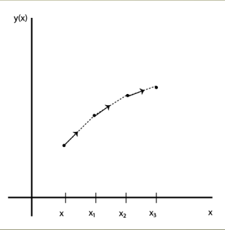

Ordinary Differential Equations
===============================

An ordinary differential equation is a differential equation in which
all dependent variables are functions of a single independent variable.
ODEs show up all over the place in physics. From analyzing Newton's laws,
to harmonic motion, to circuit analysis, these types of problems are very common
and are typically encountered with when working on realistic
physical systems.

For a given ODE, if it is reduced to its simplest form,
the highest derivative (first, second, etc.) tells us the "order"
of the ODE. In general, we would like to be able to describe
an algorithm that enables us to solve an :math:`n^{th}` order
ODE. As an example, consider

.. math::

  \frac{d^2x_j}{dt^2}=\frac{F_j(x_1,...,x_n,t)}{m_j}

where :math:`x_j` is the position of the :math:`j^{th}`
object, :math:`m_j` its mass, and :math:`F_j` is the
net force acting on that object, which may depend on any number
of other variables (:math:`x_i, t, ` etc). As written, this equation
describes a 2nd order ODE, since the second derivative is the largest (and only)
derivative in the equation. The approach that we will take to
solving such equations is to rewrite an :math:`n^{th}` order ODE as a
series of n 1:math:`^{st}` order ODEs and apply techniques that
can solve just 1:math:`^{st}` order equations. For example,
we can rewrite our equation above as

.. math::

  \frac{dx_j}{dt} &= v_j,\\
  \frac{dv_j}{dt} &= \frac{F_j(x_1,...,x_n,t)}{m_j}

As a shorthand, let's denote our first derivative using prime notation: :math:`y'`.
We are given the ODE as a function of some number of independent variables:

.. math::

  y'=\frac{dy}{dx}=f(x,y,...)

where in this case, we let the prime denote that we are taking the derivative with
respect to x. Again, we know :math:`f(x,y,...)` and we seek the solution to the
ODE: :math:`y(x,...)`. In other words, we know the derivative of y, which is a function of y and other variables, we
want to find y as a function of those other variables.

.. note:: For all of the methods discussed here, I've tried to assume that our ODEs are
  a function of a general number of variables. Of course, it is
  possible that any given ODE only be a function 1 (or even no) variables.

For any technique, in order to
solve this equation, we need some other information about our function :math:`y(x,...)`. Typically,
we are given some initial value boundary condition. For example, let's assume that
the function that we are after is only a function of a single variable, such that
:math:`y = y(x)`. Then, we may be given

.. math::
  :label: bc

  y(x_0) = y_0

the value of the function :math:`y` at some location. In order to find the value of :math:`y`
at all other locations, we must use this value. As is the case for many of the
problems that we deal with in this course, before we can
proceed, we need to discritize the domain that we are interested in. In other
words, we will find :math:`y` at all points :math:`x_i` where

.. math::

  x_i = x_0+ih

and :math:`h`, as always, is the grid spacing. Given the ODE, an initial
value and a grid, we can then proceed to implement a few different techniques
to solve our ODE.

Euler's method
--------------

The most basic technique that we can employ to solve our :math:`1_{st}` order
ODE is Euler's method. This technique exploits the fact that
we know the 1st derivative of a function, :math:`y'(x)` and an initial value of the
function itself, :math:`y(x_0)`. We then find the value of the function at a neighboring point,
:math:`y(x_1)` by assuming that the derivative is constant between the two
grid points :math:`x_0` and :math:`x_1`. We can write the technique as:

.. math::
  :label: euler

  y_{n+1} = y_n+y_n' h

Since we are given information about :math:`y'` everywhere, we can
determine :math:`y_{n+1}` if we know :math:`y_n`. Thus we require the
boundary condition in Eq. :eq:`bc`. This process is depicted graphically below.

  We are given :math:`y(x_0)` and from there we can use information about
  the derivative of y to find subsequent values of y.

In Eq :eq:`euler`, it may seem as though we don't use information about the grid.
However, remember 1) that we must know :math:`y_0` at some initial value for :math:`x`
at :math:`x_0` and 2) our ODE, :math:`y'(x,...)` may also be a function of :math:`x`.
Generally, Euler's method is relatively straightforward to implement.

1. Establish a grid that spans the domain of interest.
2. Initialize variables, including specifying the initial value condition according to Eq :eq:`bc`.
3. Create a loop that covers each grid point.
4. Evaluate the value of the ODE, :math:`y_i'` at that grid point, :math:`x_i` given :math:`y_i` .
5. Apply Eq :eq:`euler` to find the value of the function, :math:`y_{i+1}` at the next point.
6. Repeat until you've reached the end of the grid.

Although the algorithm is relatively simple, there
are 2 issues to consider: 1) error and 2) stability.

Runge-Kutta Techniques
----------------------

The methods that are typically used by scientists to solve ODEs are
called Runge-Kutta schemes (after a couple German mathematicians).
The idea is this: since Euler's method is asymmetric, it only
depends on derivatives taken at the beginning of a particular interval of interest.
This makes the errors relatively high. Runge-Kutta methods attempt to perform a
more symmetric step. First, take an Euler step to the midpoint of the
interval:

.. math::

  y_{n+\frac{1}{2}} = y_n+y'\frac{h}{2}

Then, use the values at that point to calculate the solution at the real interval.
This results in the :math:`2^{nd}` order Runge-Kutta method. Given some
ODE that is a function of some number of variables, :math:`y'(x,y,...)`:

.. math::

  k_1 &= hy'(x_n,y_n,...)\\
  k_2 &= hy'(x_n+h/2,y_n+k_1/2,...)\\
  y_{n+1} &= y_n+k_2+\mathcal{O}(h^{3})

The result of this is the first order errors are canceled out and we get a method that is
:math:`2^{nd}` order accurate. We gain accuracy by using the derivative evaluated
at an extra point, and by being smart about it.

Of course, we don't need to stop at taking the derivative at just one extra point.
We could keep going! In fact, the :math:`4_{th}` order Runge-Kutta method is one of the
most popular methods of integrating ODEs currently in use:

.. math::
  :label: rk

  k_1 &= hy'(x_n,y_n,...)\\
  k_2 &= hy'(x_n+h/2,y_n+k_1/2,...)\\
  k_3 &= hy'(x_n+h/2,y_n+k_2/2,...)\\
  k_4 &= hy'(x_n+h,y_n+k_3,...)\\
  y_{n+1} &= y_n+\frac{k_1}{6}+\frac{k_2}{3}+\frac{k_3}{3}+\frac{k_4}{6}+\mathcal{O}(h^5)

The :math:`4^{th}` order RK method isn't necessarily limited by round off error
as you increase :math:`n`, but rather, the computational effort. For every step, the
ODE must be evaluated 4 times (or in general, :math:`n` times for an :math:`n^{th}` order
RK method). As :math:`n` gets large, this means many calculations are performed for each
step. For this reason, higher order methods are not frequently used. They
don't give enough benefit in error reduction to make the decrease in
performance worthwhile.

Implementation of Runge-Kutta techniques are very similar to that of Euler's method.
The difference being that we must evaluate the :math:`k` values before we can
find :math:`y_{n+1}`:

1. Establish a grid that spans the domain of interest.
2. Initialize variables, including specifying the initial value condition according to Eq :eq:`bc`.
3. Create a loop that covers each grid point.
4. Find :math:`k_1` by evaluating the value of the ODE, :math:`y_i'` at that grid point, :math:`x_i` given :math:`y_i`.
5. Using the previous step, find :math:`k_{n+1}` by evaluating the ODE using updated values. Repeat as necessary for remaining :math:`k` s.
6. Apply final equation in Eq :eq:`rk` to find the value of the function, :math:`y_{i+1}` at the next point.
7. Repeat until you've reached the end of the grid.
